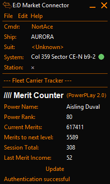
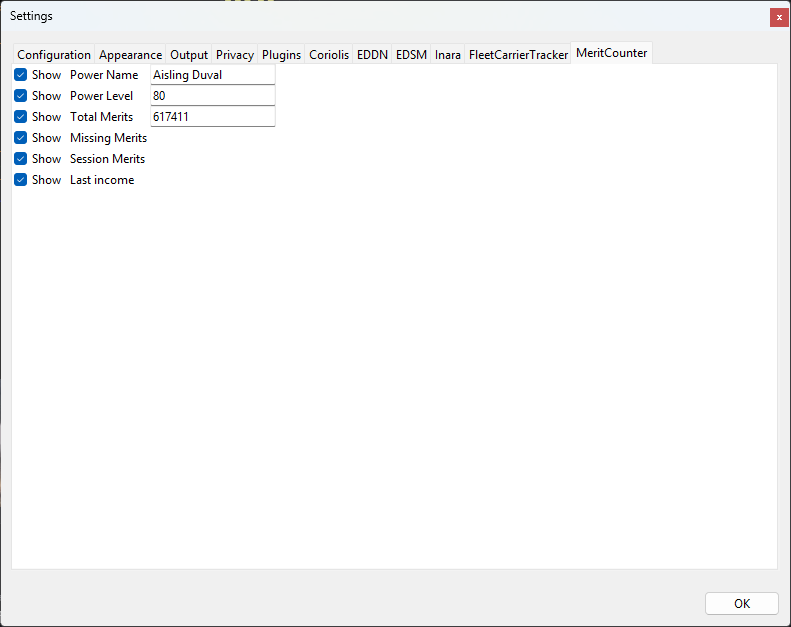

# Merit Counter - EDMC Plugin

A plugin for [Elite Dangerous Market Connector (EDMC)](https://github.com/EDCD/EDMarketConnector) designed to help commanders track their **Powerplay 2.0** progress directly from the EDMC interface.

## Features

*   **Real-time Tracking**: Displays your current pledged Power, Rank, and Total Merits.
*   **Progression Calculator**: Automatically calculates the number of merits required to reach the next rank based on Powerplay 2.0 thresholds.
*   **Session Statistics**: Tracks merits earned during the current session.
*   **Last Income**: Shows the amount of merits gained from the last valid action.
*   **Customizable Interface**: Toggle visibility for any field via the settings menu to keep the interface clean.

## Screenshots

### Plugin Interface

### Settings

## Installation

1.  Download the latest release of this plugin.
2.  Open **EDMC**.
3.  Navigate to **File** -> **Settings** -> **Plugins**.
4.  Click **Open** to reveal the plugins folder location on your computer.
5.  Extract the `MeritCounter` folder from the downloaded archive into this plugins directory.
6.  Restart EDMC.

## Usage

The plugin listens to game journal events (`Powerplay`, `PowerplayMerits`, `PowerplayRank`) to update your statistics automatically. 

You can customize what is shown (Power Name, Rank, Session totals, etc.) in the EDMC Settings under the **MeritCounter** tab.
